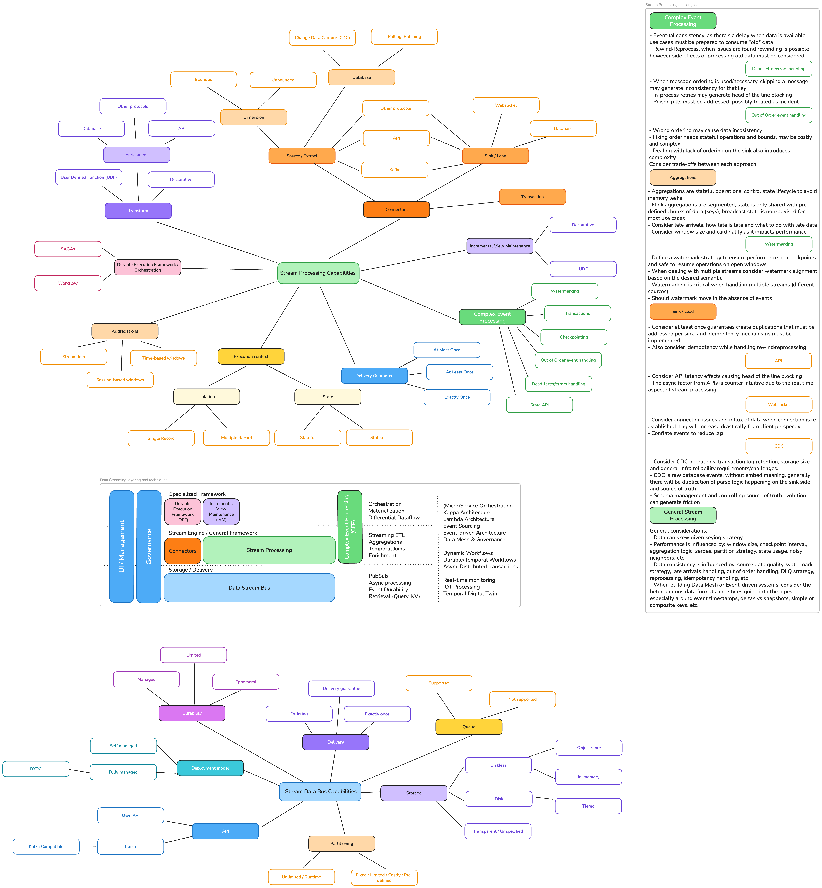

# Stream Processing Capabilities

This diagram is a comprehensive representation of data streaming processing capabilities, designed for learning and tool evaluation purposes. It demonstrates various approaches to stream processing, needed features, semantics, capabilities and general challenges.

We also have a [video](https://www.youtube.com/watch?v=M0iVcDNeNM0&t=3s) by [Renato Mefi](https://www.linkedin.com/in/renatomefi/) explaining each of the capabilities

## License and author
❤️ Created by [Renato Mefi](https://www.linkedin.com/in/renatomefi/) and sponsored by [Evoura](https://evoura.com/)

This project is licensed under [CC BY-NC 4.0](LICENSE.md) - feel free to use and modify it for non-commercial purposes, but credit must be given to the original author.
